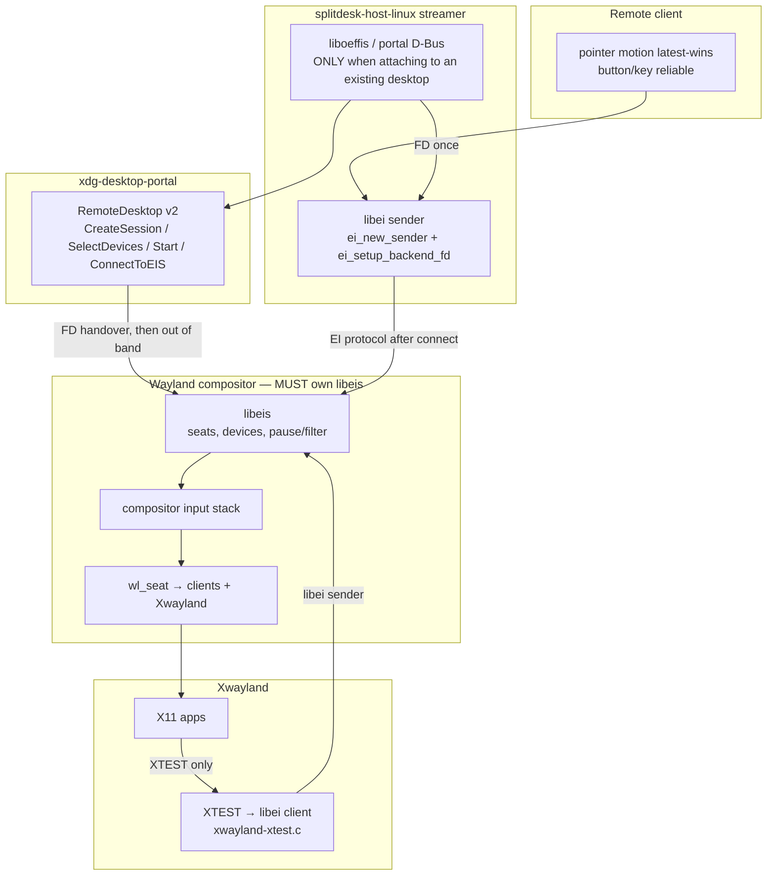

# Q8–Q10: libei / XWayland / CloudCompare

Investigated against cloned upstream trees and vendor docs (2026-08-25). No CloudCompare run was performed.

| Artifact | Version / commit |
|---|---|
| libei | 1.6.0 (`a9bf31d`) |
| Weston | 16.0.90 (`6161d79`) |
| xdg-desktop-portal | 23.0 (`0542d2b`) |
| xorg/xserver (Xwayland) | 26.1.99.1 (`867976b`) |
| NVIDIA Linux driver README | 570.133.07 |
| Qt docs | 6.11.2 |
| CloudCompare | `master` BUILD.md (2.14+ / Qt 6) |

Verdicts: `SUPPORTED` | `PARTIAL` | `UNSUPPORTED` | `UNKNOWN`.

---

## Q8. Where should libei / libeis sit (compositor vs portal vs streamer)?

**Verdict: PARTIAL**

Official layering is unambiguous. SplitDesk cannot treat it as fully supported on the planned Weston host because Weston 16.0.90 does not implement EIS.

### Official placement

| Piece | Process | Role |
|---|---|---|
| **libeis** | Wayland compositor | Server. Owns seats/devices. Accepts clients. Injects events into the compositor input stack. |
| **libei** | Streamer / remoting client / Xwayland (XTEST) | Client. Sender context emulates pointer/keyboard/touch. |
| **xdg-desktop-portal RemoteDesktop** | Session broker | Auth + `ConnectToEIS()` FD handover. **Not** on the per-event path after connect. |
| **liboeffis** | Optional helper in the streamer | D-Bus boilerplate for the portal; still hands the FD to libei. |

libei README:

> In the Wayland stack, the EIS server component is part of the compositor, the EI client component is part of the Wayland client.

libeis header (`src/libeis.h`):

> libeis is the server-side module. This API should be used by processes that have control over input devices, e.g. Wayland compositors.

Portal docs (interface version 2):

> **EIS (recommended):** Call `ConnectToEIS()` after starting the session to obtain a file descriptor for a libei sender context. Input events are sent via the EI protocol. Once an EIS connection is established, the `Notify*` D-Bus methods must not be used.

`ConnectToEIS`:

> The returned handle can be passed to `ei_setup_backend_fd()` for a libei sender context to complete the connection.

libei README portal handshake:

> from then on, `libei` and `libeis` talk directly to each other, the portal has no further influence.

libei API:

```c
int ei_setup_backend_fd(struct ei *ei, int fd);
```

`ei_setup_backend_socket()` is documented as testing/debug; production EIS implementations should mint a pre-created FD per client.

Xwayland (xserver 26.1.99.1) already consumes libei as a **client** for XTEST (`hw/xwayland/xwayland-xtest.c` includes `<libei.h>` and optionally `liboeffis.h`). That does not move libeis into Xwayland.

### Weston gap

Weston 16.0.90 contains **no** `libei` / `libeis` / `ConnectToEIS` references. Headless can create a fake `wl_seat` (`fake_seat` in `weston_headless_backend_config`) but that is not EIS.

libei README still describes XTEST-via-libei as a PoC “with Weston”; current Xwayland has the client side, Weston still lacks the server side.

### SplitDesk implication

- **Do not put libeis in the streamer.** The compositor must remain in control (filter, pause, per-client devices).
- **Do not put libei in the compositor.**
- **Portal is not the default for a dedicated per-user Weston.** Portal `Start()` is designed for a user-consent desktop session. A SplitDesk-owned compositor should mint an EIS FD internally (or a private UNIX socket) and pass it to the streamer.
- **Portal is the default when attaching to an existing desktop** (Mutter/KWin/etc. that already implement EIS + a portal backend). Streamer: `CreateSession` → `SelectDevices` → `Start` → `ConnectToEIS` → `ei_setup_backend_fd`. After that, motion/button/key go over EI, not D-Bus `Notify*`.
- **Do not use global uinput or xdotool as the primary input path.** libei README: uinput is an EIS-server implementation detail requiring `/dev/uinput` (usually root); XTEST has no useful separation/control. Both violate SplitDesk constraints.
- Until Weston grows libeis (or SplitDesk uses a compositor that already has it), Linux input injection against Weston is **not** the portal/libei path. Options: add libeis to Weston, switch compositor, or use compositor-private virtual-seat APIs (not specified as EIS).

### Recommended input layering



Dedicated SplitDesk Weston session (no portal):

```
remote client
    |  SplitDesk Input (motion latest-wins; button/key reliable)
    v
streamer  --libei sender / ei_setup_backend_fd-->  compositor libeis
                                                     |
                                                     v
                                              wl_seat / Xwayland
```

Existing-desktop attach:

```
streamer --D-Bus--> xdg-desktop-portal --ConnectToEIS fd--> streamer libei
                                                              |
                                                              | EI
                                                              v
                                                         compositor libeis
```

**Do not:** streamer → uinput → kernel → compositor libinput (global, root, no per-session isolation).

Official URLs:

- https://gitlab.freedesktop.org/libinput/libei
- https://libinput.pages.freedesktop.org/libei/libraries/index.html
- https://libinput.pages.freedesktop.org/libei/api/index.html
- https://flatpak.github.io/xdg-desktop-portal/docs/doc-org.freedesktop.portal.RemoteDesktop.html

---

## Q9. Are XWayland apps GPU-accelerated under per-user Weston / headless (GLX / EGL / DRI3 / NVIDIA)?

**Verdict: PARTIAL**

Hardware GLX/EGL via DRI3+glamor is the designed Xwayland path. It is not guaranteed under Weston headless, and NVIDIA adds extra requirements and missing features.

### Weston Xwayland module

Enable with `xwayland=true` in `[core]` or `--xwayland`. Do **not** load `xwayland.so` via `modules=` (Weston treats that as fatal).

`weston.ini(5)`:

> `xwayland=true` — ask Weston to load the XWayland module (boolean).

`[xwayland]` only documents:

> `path=` — sets the path to the xserver to run (string).

Weston spawns Xwayland **rootless**, with listen FDs and `-wm` (`frontend/xwayland.c`):

```
custom_env_add_arg(&child_env, xserver);
custom_env_add_arg(&child_env, display);
custom_env_add_arg(&child_env, "-rootless");
...
custom_env_add_arg(&child_env, "-wm");
```

`WAYLAND_DISPLAY=splitdesk-<id>` is enough for that Xwayland to attach to the per-user compositor; Weston also passes `WAYLAND_SOCKET`.

### Headless compositor GPU vs client GPU

Weston headless is documented as “run without input or output, useful for test suite”, but it **can** initialize GL or Vulkan.

Headless GL display (`libweston/backend-headless/headless.c`):

```c
.egl_platform = EGL_PLATFORM_SURFACELESS_MESA,
.egl_native_display = NULL,
```

DRM/KMS Weston uses `EGL_PLATFORM_GBM_KHR` instead. Headless therefore:

- does **not** take DRM master / seat0 KMS (matches SplitDesk “do not take seat0 DRM master”);
- compositor composition can still use a GPU via Mesa surfaceless EGL if the driver provides `EGL_MESA_platform_surfaceless`;
- pixman/noop renderers skip that GPU path for **compositor** composition.

X11 client GPU accel is **Xwayland’s** job, not Weston’s renderer:

1. Xwayland glamor creates an EGL display on GBM (`xwl_glamor_init_gbm`).
2. `glamor_egl_screen_init()` calls `glamor_enable_dri3(screen)`.
3. GLX clients use DRI3 to share GPU buffers with Xwayland.
4. Xwayland presents those buffers to Weston as a Wayland client (`linux-dmabuf` / wl_buffer). If glamor/GBM fails, Xwayland falls back to SHM (CPU).

Xwayland man:

> `XWAYLAND_NO_GLAMOR` — disable glamor and DRI3 support in Xwayland, for testing purposes.

> `-shm` — Force the shared memory backend instead of glamor (if available) for passing buffers to the Wayland server.

xwayland-screen.c:

> `xwayland glamor: failed to setup GBM backend, falling back to sw accel`

> `Failed to initialize glamor, falling back to sw`

So: **SUPPORTED in the Xwayland design; PARTIAL for a given Weston-headless + driver combo.** Client GL can be GPU-backed even when Weston composites in surfaceless EGL or pixman, **if** Xwayland GBM/DRI3 comes up and Weston can import dmabuf. If either side lacks dmabuf/GBM, frames go SHM (CPU copy) — measure it, do not claim zero-copy.

### NVIDIA

NVIDIA README 570.133.07, Chapter 39:

> The NVIDIA driver is able to facilitate accelerated 3D rendering for such applications, but there are some particular considerations…

Requirements include DRM KMS, a recent Xwayland (GBM path from xserver commit `c468d34c`; 21.1.3+), libxcb ≥ 1.13, egl-wayland ≥ 1.1.7 (1.1.9+ for `wl_drm` GPU selection used by Xwayland).

Chapter 40 (GBM):

> Xwayland uses the GLAMOR backend to accelerate X application rendering using EGL. … GLAMOR acceleration is required for good performance when running accelerated Vulkan or OpenGL X11 applications. … To use the GBM path with the NVIDIA driver's GBM backend … Xwayland versions 21.1.3 and above satisfy this requirement.

Appendix L limitations that hit this architecture:

- Front-buffer rendering in GLX does not work with Xwayland.
- Indirect GLX is not supported by Xwayland.
- Hardware overlays cannot be used by GLX applications with Xwayland.
- NvFBC does not work with Xwayland.

NVIDIA GBM **compositor** support is specified for DRM KMS + `libgbm.so.1` (Mesa ≥ 21.2). Weston **headless** is surfaceless EGL, not GBM/KMS. That is a documented compositor path mismatch: NVIDIA-accelerated **Xwayland clients** may still work (Xwayland talks GBM/EGL itself) while Weston-headless composition on NVIDIA is **not** the Chapter 40 GBM compositor story. Treat NVIDIA + Weston-headless as unproven; prefer Mesa/Intel/AMD surfaceless, or a non-master DRM/render-node setup that still does not steal seat0.

### SplitDesk implication

- Enable Weston `xwayland=true`, spawn as the session UID, `WAYLAND_DISPLAY=splitdesk-<id>`.
- Prefer `--renderer=gl` (or vulkan) on headless so the compositor can import GPU buffers; pixman forces extra copies if clients present dmabuf that must be read back.
- Do not set `XWAYLAND_NO_GLAMOR` or `-shm` in production.
- Diagnose with Xwayland logs (`falling back to sw accel`) and client `glxinfo`/`eglinfo`; llvmpipe means the DRI3/GBM path failed.
- Never claim zero-copy unless `diagnostics media-path` shows GPU memory types end-to-end.

Official URLs:

- https://wayland.pages.freedesktop.org/weston/toc/running-weston.html
- https://gitlab.freedesktop.org/wayland/weston (man/weston.ini.man, frontend/xwayland.c, libweston/backend-headless/headless.c)
- https://gitlab.freedesktop.org/xorg/xserver (hw/xwayland)
- https://download.nvidia.com/XFree86/Linux-x86_64/570.133.07/README/xwayland.html
- https://download.nvidia.com/XFree86/Linux-x86_64/570.133.07/README/gbm.html
- https://download.nvidia.com/XFree86/Linux-x86_64/570.133.07/README/wayland-issues.html

---

## Q10. Can CloudCompare (Qt + OpenGL, often X11) run in this architecture?

**Verdict: UNKNOWN**

No official CloudCompare statement about Weston, headless, XWayland, or remote-desktop compositors was found. Architectural prerequisites exist; that is not a run result.

### What CloudCompare officially is

BUILD.md (2.14+):

> The main dependency of CloudCompare is Qt. CloudCompare 2.14+ requires Qt 6.

Linux packages include `libqt6opengl6-dev` (or Qt5 `libqt5opengl5-dev` on older Ubuntu).

The 3D view is a `QOpenGLWidget`:

```cpp
class ccGLWindow : public QOpenGLWidget, public ccGLWindowInterface
```

(`libs/qCC_glWindow/include/ccGLWindow.h`)

No `WAYLAND_DISPLAY`, `QT_QPA_PLATFORM`, XWayland, or Weston references in that BUILD.md / `ccGLWindow.h` / `qCC/main.cpp` path.

### Qt platform plugins (wayland vs xcb)

Qt 6.11 QPA table:

| Plugin | Class | Meaning |
|---|---|---|
| `qwayland` | `QWaylandIntegrationPlugin` (+ EGL/GLX variants) | Native Wayland client |
| `qxcb` | `QXcbIntegrationPlugin` | X11; under Wayland this is XWayland |

`QGuiApplication`:

> `-platform platformName[:options]`, specifies the Qt Platform Abstraction (QPA) plugin. Overrides the `QT_QPA_PLATFORM` environment variable.

> `wayland` is a platform plugin for the Wayland display server protocol…

> `xcb` is a plugin for the X11 window system…

Fallback list is supported (`-qpa xcb;wayland` / `QT_QPA_PLATFORM=xcb;wayland`). `platformName()` without a `QGuiApplication` ignores `-platform` / `QT_QPA_PLATFORM`.

Wayland Qt OpenGL typically uses the `wayland-egl` integration plugin. Xcb Qt OpenGL uses GLX and/or EGL against the X server — here, Xwayland’s glamor/DRI3 (Q9).

### How it *could* run (not tested)

1. **Native Wayland:** `QT_QPA_PLATFORM=wayland` (or `wayland-egl`) inside `WAYLAND_DISPLAY=splitdesk-<id>`. Needs `qt6-wayland` / Qt Wayland EGL plugin and a compositor that speaks the protocols Qt wants (xdg-shell, linux-dmabuf, …). Weston desktop/kiosk + xdg-shell is the usual case; missing protocols → startup fail, not silent software GL.
2. **XWayland (historical X11 default):** `QT_QPA_PLATFORM=xcb` + Weston `xwayland=true`. CloudCompare then talks GLX/EGL to Xwayland. GPU vs llvmpipe is Q9, not a CloudCompare guarantee.
3. **Headless Weston without a `wl_seat`:** Qt/X11 apps often require a seat/pointer. Weston’s headless `fake_seat` exists for “some clients may complain without a wl_seat”; enable it. Input still needs Q8 (libeis or equivalent) for a remote user.

OpenGL plugins (`qEDL`, `qSSAO`) are extra GL passes on the same `QOpenGLWidget`; they inherit whatever GPU path the windowing system provided.

### SplitDesk implication

- Ship **both** launch paths: prefer `wayland` when Qt Wayland EGL is installed; fall back to `xcb` + Xwayland.
- Do not advertise CloudCompare as a supported GPU app until a real session shows a hardware renderer (not llvmpipe) and interactive 3D input.
- Do not force EGLFS (`qeglfs`); that bypasses the compositor.
- Files stay on the host; the process is a normal user app on that Weston’s `WAYLAND_DISPLAY`.

Official URLs:

- https://github.com/CloudCompare/CloudCompare/blob/master/BUILD.md
- https://github.com/CloudCompare/CloudCompare/blob/master/libs/qCC_glWindow/include/ccGLWindow.h
- https://doc.qt.io/qt-6/qpa.html
- https://doc.qt.io/qt-6/qguiapplication.html

---

## Cross-cutting recommendations for SplitDesk

1. **Input:** libeis in the compositor; libei in the streamer; portal only when remoting an existing desktop. Weston 16.0.90 needs EIS work or a different compositor.
2. **X11 apps:** Weston `xwayland=true`, rootless Xwayland, no `XWAYLAND_NO_GLAMOR`.
3. **GPU:** Headless + `renderer=gl` (surfaceless EGL) + Xwayland glamor/DRI3/GBM. NVIDIA is documented for Xwayland GBM, not for Weston-headless-as-GBM-compositor. Report `MemoryPath` honestly.
4. **CloudCompare:** UNKNOWN until tested; Qt `wayland` vs `xcb` is the only official lever.

---

## Source index

| # | Repo / vendor | Path | What was quoted |
|---|---|---|---|
| 1 | libinput/libei 1.6.0 | README.md | compositor=libeis, client=libei; portal FD handover; uinput vs libei; XTEST PoC |
| 2 | libinput/libei | src/libeis.h | libeis for compositors |
| 3 | libinput/libei | src/libei.h | `ei_setup_backend_fd` |
| 4 | libinput/libei | doc/api/mainpage.dox, doc/protocol/libraries/_index.md | three libraries; liboeffis sequence |
| 5 | flatpak/xdg-desktop-portal 23.0 | data/org.freedesktop.portal.RemoteDesktop.xml | EIS recommended; `ConnectToEIS` |
| 6 | wayland/weston 16.0.90 | man/weston.ini.man | `xwayland=true`; `[xwayland] path=`; headless backend; `renderer=` |
| 7 | wayland/weston | frontend/xwayland.c | spawn `-rootless` Xwayland |
| 8 | wayland/weston | libweston/backend-headless/headless.c | `EGL_PLATFORM_SURFACELESS_MESA`; `fake_seat` |
| 9 | wayland/weston | tree-wide grep | **no** libei/libeis |
| 10 | xorg/xserver 26.1.99.1 | hw/xwayland/xwayland-glamor.c | `glamor_enable_dri3` |
| 11 | xorg/xserver | hw/xwayland/xwayland-screen.c | GBM/glamor software fallback |
| 12 | xorg/xserver | hw/xwayland/man/Xwayland.man | `-glamor`, `-shm`, `XWAYLAND_NO_GLAMOR` |
| 13 | xorg/xserver | hw/xwayland/xwayland-xtest.c | XTEST → libei client |
| 14 | NVIDIA 570.133.07 | README/xwayland.html, gbm.html, wayland-issues.html | Xwayland GPU requirements and gaps |
| 15 | Qt 6.11 | qpa.html, qguiapplication.html | wayland vs xcb; `QT_QPA_PLATFORM` |
| 16 | CloudCompare master | BUILD.md, ccGLWindow.h | Qt 6 + `QOpenGLWidget` only |
